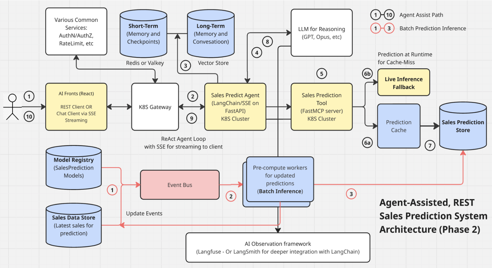
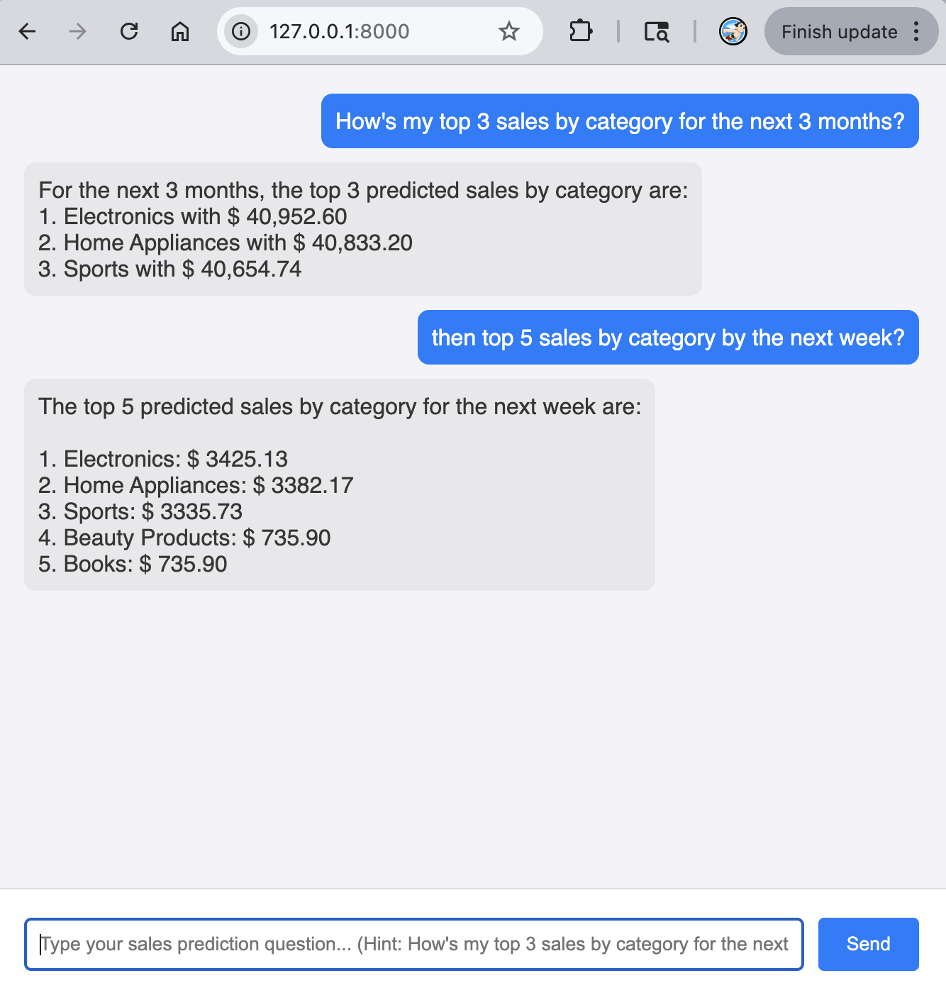
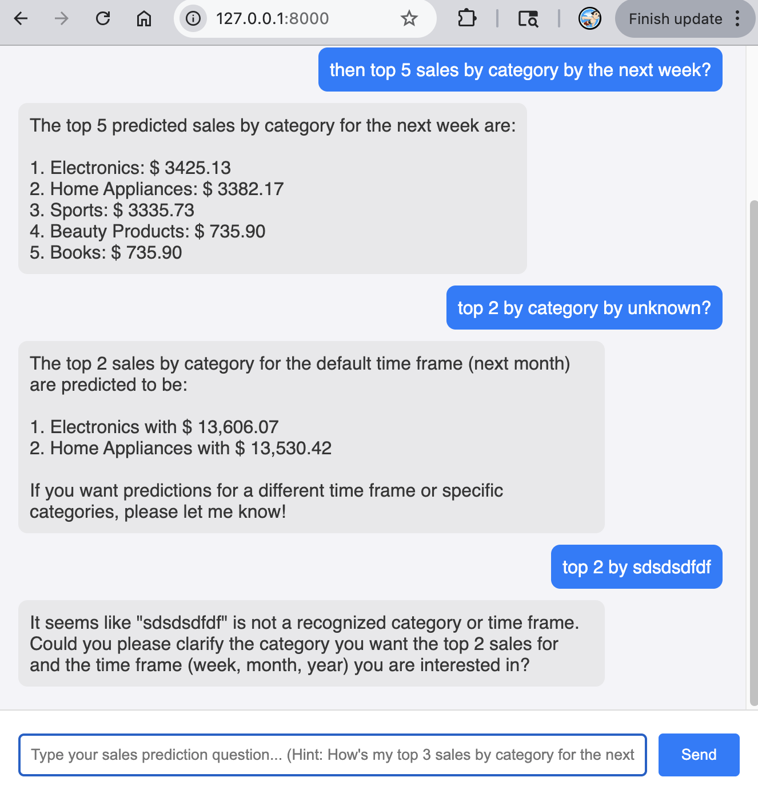

# Craft — AI-Powered Sales Prediction

A proof-of-concept application that combines a **LightGBM sales forecasting model** with a **GPT-4.1-mini agent** to answer natural-language queries about sales predictions. Built with FastAPI, LangChain, and Server-Sent Events (SSE) for real-time streaming responses.

## System Architecture


Note that the same sales prediction service supports both Chat (SSE streaming) and REST clients.

## Tech Stack

| Layer           | Technology                              |
| --------------- | --------------------------------------- |
| Backend / API   | FastAPI, Uvicorn                        |
| AI Agent        | LangChain (LCEL), LangGraph ReAct agent |
| LLM             | OpenAI GPT-4.1-mini                     |
| ML Model        | LightGBM (sales forecasting)            |
| Streaming       | Server-Sent Events (SSE)                |
| REST API        | FastAPI `POST /predict/sales` endpoint  |
| Config          | Pydantic Settings, python-dotenv        |
| Package Manager | `uv`                                    |

## Folder Structure

```
app/
  api/          # SSE and REST endpoints (FastAPI routers)
  core/         # Settings and configuration (pydantic-settings)
  models/       # LGBM model artifact and training data
  prompts/      # System prompt for the sales agent
  schemas/      # Pydantic request/response models
  services/     # LangChain agent construction and SSE streaming logic
  tools/        # LangChain @tool — Sales prediction with feature engineering
```

The agent follows a **ReAct loop**: it receives a natural-language question, decides whether to invoke the `predict_sales` tool, interprets the model output, and streams a formatted answer back to the client via SSE.

The same underlying prediction logic is also exposed as a dedicated **REST endpoint** (`POST /predict/sales`) for direct programmatic access, bypassing the agent entirely.

## Prerequisites

- Python 3.14+
- [`uv`](https://github.com/astral-sh/uv) package manager
- An OpenAI API key

## Getting Started

**1. Clone the repository and install dependencies**

```bash
git clone https://github.com/baechul/craft-poc.git
cd craft-poc
uv sync
```

**2. Configure environment variables**

Create a `.env` file in the project root:

```env
OPENAI_API_KEY=your-openai-api-key
```

**3. Start the development server**

```bash
uv run uvicorn app.main:app --reload
```

**4. Option 1: Use the prediction Chat Client**

Navigate to [http://127.0.0.1:8000](http://127.0.0.1:8000) and ask a sales question, for example:

> _"What are my top 3 sales categories for the next 3 months?"_

**5. Option 2: Use the prediction REST API**

You can also call the prediction model directly without the agent:

```bash
curl -X POST http://127.0.0.1:8000/predict/sales \
  -H "Content-Type: application/json" \
  -d '{"top_n": 3, "timeframe": "month", "frame_k": 1}'
```

Example response:

```json
{
  "top_n": 3,
  "timeframe": "month",
  "frame_k": 1,
  "predictions": [
    { "category": "Electronics", "predicted_revenue": 128450.75 },
    { "category": "Clothing", "predicted_revenue": 94320.1 },
    { "category": "Home & Garden", "predicted_revenue": 76180.4 }
  ]
}
```

**6. Predict top products (alternative endpoint)**

You can also retrieve top-selling products instead of revenue by category:

```bash
curl -X POST http://127.0.0.1:8000/predict/products \
  -H "Content-Type: application/json" \
  -d '{"top_p": 5, "timeframe": "month", "frame_k": 1}'
```

Example response:

```json
{
  "top_p": 5,
  "timeframe": "month",
  "frame_k": 1,
  "predictions": [
    {
      "product_name": "Wireless Earbuds",
      "product_category": "Electronics",
      "predicted_units": 1250
    },
    {
      "product_name": "USB-C Cable",
      "product_category": "Electronics",
      "predicted_units": 980
    },
    {
      "product_name": "Phone Case",
      "product_category": "Electronics",
      "predicted_units": 875
    },
    {
      "product_name": "Screen Protector",
      "product_category": "Electronics",
      "predicted_units": 720
    },
    {
      "product_name": "Laptop Stand",
      "product_category": "Office Supplies",
      "predicted_units": 450
    }
  ]
}
```

### REST API Parameters

**For `/predict/sales`:**

| Parameter   | Type    | Default | Description                                     |
| ----------- | ------- | ------- | ----------------------------------------------- |
| `top_n`     | integer | `3`     | Number of top categories to return (1–20).      |
| `timeframe` | string  | `month` | Forecast horizon unit: `week`, `month`, `year`. |
| `frame_k`   | integer | `1`     | Number of timeframe units to forecast (1–12).   |

**For `/predict/products`:**

| Parameter   | Type    | Default | Description                                     |
| ----------- | ------- | ------- | ----------------------------------------------- |
| `top_p`     | integer | `5`     | Number of top products to return (1–50).        |
| `timeframe` | string  | `month` | Forecast horizon unit: `week`, `month`, `year`. |
| `frame_k`   | integer | `1`     | Number of timeframe units to forecast (1–12).   |

Interactive API docs are available at [http://127.0.0.1:8000/docs](http://127.0.0.1:8000/docs).

## ML Model

The LightGBM model was trained separately on historical sales data with lag features and seasonal encodings. It is loaded at application startup via FastAPI's lifespan context.

For details on model training and generation, see the companion repository: [baechul/craft-poc-model](https://github.com/baechul/craft-poc-model).

## Sales Prediction Calculation Algorithm

The prediction pipeline implemented in [app/tools/predict_sales.py](app/tools/predict_sales.py) runs through the following stages:

### 1. Data Ingestion

Historical sales data is read from `app/models/sales.csv`, loading only the three columns required for inference (`date`, `product_category`, `total_revenue`) to minimise memory usage.

### 2. Aggregation

Daily revenue is summed per product category to produce a clean category-date time series, sorted chronologically within each category.

### 3. Feature Engineering

The following features are derived to match what the model was trained on:

| Feature                 | Description                                           |
| ----------------------- | ----------------------------------------------------- |
| `year`, `month`, `week` | Calendar components extracted from the date           |
| `day_of_week`           | Day index (0 = Monday, 6 = Sunday)                    |
| `category_encoded`      | Numeric label encoding of the product category string |
| `revenue_lag_1`         | Revenue 1 day prior                                   |
| `revenue_lag_7`         | Revenue 7 days prior                                  |
| `revenue_lag_14`        | Revenue 14 days prior                                 |
| `revenue_lag_30`        | Revenue 30 days prior                                 |

Rows with any missing lag values (caused by the shift operation at the start of the series) are dropped before forecasting begins.

### 4. Iterative Multi-Step Forecasting

For each product category the model performs a **rolling one-step-ahead forecast** over the requested horizon:

$$\hat{y}_{t+1} = f\bigl(\text{category}, \text{calendar}_{t+1}, \hat{y}_t, \hat{y}_{t-6}, \hat{y}_{t-13}, \hat{y}_{t-29}\bigr)$$

where $f$ is the trained LightGBM model. At each step:

1. A feature row is constructed from the next calendar date and the lag window of the accumulated revenue history.
   I selected four lag checkpoints (1, 7, 14, 30 days back) for the model to be trained on. For example,
   revernue*lag_7 is used to measure the distance from the prediction target date (t+1) so (t+1)-7 looks back 7 days ago from (t+1).
   (t+1)-7 = t-6 which is used in $\hat{y}*{t-6}$
2. The model predicts the next day's revenue; negative predictions are clamped to `0.0`.
3. The predicted value is appended to the rolling history so subsequent steps can reference it as a lag feature.

The horizon length is determined by the requested timeframe:

| Timeframe | Horizon (days) |
| --------- | -------------- |
| `week`    | 7 x k          |
| `month`   | 30 x k         |
| `year`    | 365 x k        |

where k is `frame_k` (the number of timeframe units requested).

### 5. Ranking & Output

All per-day forecasts are aggregated by summing predicted revenue per category over the full horizon. The top `N` categories by total projected revenue are returned, ranked in descending order.

## Screenshots





## License

MIT © 2026 Baechul Kim
